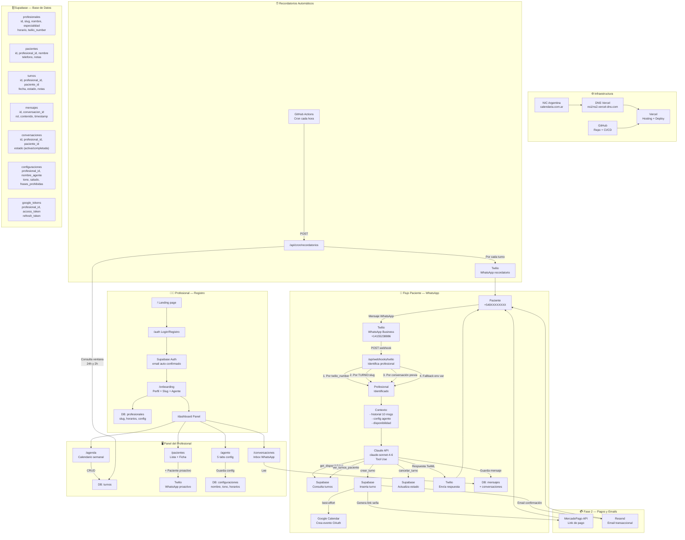

# Calendaria — Flujo Completo del Sistema

> **Importar a XMind:** File → Import → Markdown → seleccionar este archivo
> **Ver diagrama Mermaid:** abrir en VS Code con extensión Mermaid o en GitHub

---

## DIAGRAMA DE FLUJO (Mermaid)

---

# 1. INFRAESTRUCTURA BASE

## Dominio
### NIC Argentina
- Registra calendaria.com.ar
- Delegación a Vercel DNS: ns1.vercel-dns.com + ns2.vercel-dns.com
- Propagación: 24-48hs

### Vercel
- Hosting de la app Next.js 14
- Deploy automático desde GitHub (push a main → build → deploy)
- Variables de entorno (15+ vars: Supabase, Claude, Twilio, Google)
- SSL automático
- URL producción: https://calendaria.com.ar

### GitHub
- Repositorio del código fuente
- CI/CD: push → Vercel deploy automático
- GitHub Actions: crons de recordatorios (gratuito)

---

# 2. BASE DE DATOS — SUPABASE

## Tablas principales
### profesionales
- id (UUID), nombre, especialidad, slug (UNIQUE)
- horario_inicio, horario_fin, dias_laborables
- twilio_number (para multi-tenant futuro)
- google_calendar_id

### pacientes
- id, profesional_id (FK), nombre, telefono, email
- notas, fecha_creacion

### turnos
- id, profesional_id (FK), paciente_id (FK)
- fecha_hora (UTC), duracion_minutos
- estado (pendiente / confirmado / cancelado / completado)
- notas, google_event_id

### conversaciones
- id, profesional_id (FK), paciente_id (FK)
- telefono_paciente, estado (activa / completada)
- fecha_inicio, fecha_fin

### mensajes
- id, conversacion_id (FK)
- rol (user / assistant), contenido
- timestamp

### configuraciones
- profesional_id (FK, UNIQUE)
- nombre_agente (default: Aurora)
- tono (formal / amigable / profesional)
- saludo_personalizado, mensaje_cierre
- frases_prohibidas (array)

### google_tokens
- profesional_id (FK)
- access_token, refresh_token, expiry

## Seguridad
### Row Level Security (RLS)
- Cada profesional solo ve sus propios datos
- Filtrado automático por profesional_id en cada query
- Multi-tenant sin lógica extra en la app

### Auth
- Supabase Auth (email + password)
- Email auto-confirmado al registrarse (Admin API)
- Sesión manejada con @supabase/ssr

---

# 3. REGISTRO Y ONBOARDING DEL PROFESIONAL

## Paso 1 — Landing page (/)
- Hero, features, precios
- CTA → /auth

## Paso 2 — Auth (/auth)
- Formulario login / registro
- POST /api/auth/profesional
- Crea usuario en Supabase Auth
- Crea registro en tabla profesionales
- Email auto-confirmado
- Redirect → /onboarding

## Paso 3 — Onboarding (/onboarding)
### Tab 1: Perfil
- Nombre, especialidad, teléfono
- Slug (auto-sugerido desde especialidad)
- Validación en tiempo real (unicidad en DB)
- Preview del link: calendaria.com.ar/w/slug

### Tab 2: Agente
- Nombre del agente (default: Aurora)
- Tono de comunicación
- Horarios de atención por día
- Toggle por día + inputs de hora inline

### Tab 3: Listo
- Link de WhatsApp personalizado
- QR para compartir
- Redirect → /dashboard

---

# 4. FLUJO PRINCIPAL — PACIENTE ENVÍA WHATSAPP

## Inicio del flujo
### Paciente accede al link
- calendaria.com.ar/w/slug → redirige a wa.me/14155238886?text=TURNO:slug
- WhatsApp abre con mensaje pre-cargado

## Twilio recibe el mensaje
### Número compartido: +14155238886
- Twilio Sandbox (desarrollo) / WhatsApp Business (producción)
- Twilio hace POST a /api/webhooks/twilio con datos del mensaje

## Identificación del profesional (/api/webhooks/twilio)
### Prioridad 1: número individual
- `To` coincide con twilio_number del profesional en DB

### Prioridad 2: slug en mensaje
- Mensaje empieza con TURNO:slug → busca por slug en profesionales

### Prioridad 3: conversación previa
- Teléfono del paciente tiene conversación activa → usa profesional_id de esa conversación

### Prioridad 4: fallback
- NEXT_PUBLIC_PROFESIONAL_ID (solo en desarrollo)

## Preparación del contexto
### Historia de conversación
- Últimos 10 mensajes (evita contaminación entre sesiones)
- Conversación se cierra al confirmar turno → próximo mensaje empieza limpio

### System prompt dinámico
- Nombre del agente, tono, saludo, cierre desde tabla configuraciones
- Horarios de atención, duración de turnos
- Protocolo de crisis (menciones de autolesión → líneas 135 / 0800-345-1435 + notificar profesional)

## Claude API — Agente con Tool Use
### Modelo
- claude-sonnet-4-6

### Herramientas disponibles
#### get_disponibilidad
- Parámetros: fecha, profesional_id
- Consulta turnos existentes en Supabase
- Retorna slots libres según horario configurado

#### crear_turno
- Parámetros: paciente_nombre, paciente_telefono, fecha_hora, duracion, notas
- Crea/actualiza paciente en DB
- Inserta turno en DB
- Crea evento en Google Calendar (best-effort)
- Cierra conversación activa

#### cancelar_turno
- Parámetros: turno_id o fecha + paciente
- Actualiza estado a 'cancelado' en DB
- (Fase 2) Cancela evento en Google Calendar

#### ver_turnos_paciente
- Parámetros: telefono_paciente
- Lista turnos próximos del paciente

## Respuesta al paciente
### TwiML
- Claude devuelve texto
- Webhook formatea como TwiML (MessagingResponse)
- Twilio envía WhatsApp al paciente

### Almacenamiento
- Mensaje del paciente guardado en DB (rol: user)
- Respuesta de Aurora guardada en DB (rol: assistant)

---

# 5. GOOGLE CALENDAR — SINCRONIZACIÓN

## OAuth por profesional
### Flujo
- /agente → botón "Conectar Google Calendar"
- Redirect → /api/auth/google → Google OAuth consent
- Callback → /api/auth/google/callback
- Tokens guardados en tabla google_tokens

### Uso en agente
- Al crear_turno: recupera tokens desde DB → crea evento en Google Calendar
- Best-effort: si falla Google Calendar, el turno igual se guarda en Supabase

---

# 6. PANEL DEL PROFESIONAL

## /dashboard
### Métricas en tiempo real
- Turnos de hoy, semana, mes
- Pacientes totales, nuevos este mes
- Conversaciones activas

### AgendaHoy
- Lista de turnos del día con estado

### ActivityFeed
- Últimas acciones del agente

## /agenda
### Calendario semanal navegable
- Datos reales desde Supabase
- Vistas por semana con navegación

### Modal + Turno
- Autocomplete de pacientes existentes
- Selector de fecha y hora
- Duración configurable
- Notas opcionales
- Conversión AR → UTC automática

### Acciones sobre turnos
- Cancelar turno → actualiza estado en Supabase (optimistic update)
- Marcar completado → actualiza estado en Supabase (optimistic update)

## /conversaciones
### Inbox WhatsApp
- Lista de conversaciones con pacientes
- Estado: activa / completada

### Chat real
- Mensajes desde tabla mensajes en Supabase
- Panel de razonamiento IA (tool calls visibles)

## /pacientes
### Lista de pacientes
- Nombre, teléfono, especialidad, último turno

### Ficha de paciente
- Historial completo de turnos
- Notas

### Agregar paciente proactivo
- Modal con datos del paciente
- POST /api/data/pacientes
- Crea paciente en DB
- Envía WhatsApp proactivo vía Twilio REST
- Crea conversación inicial

## /agente — 5 tabs
### Tab: Personalidad
- Nombre del agente (Aurora por defecto)
- Tono de comunicación
- Saludo personalizado
- Mensaje de cierre

### Tab: Reglas de agenda
- Toggle por día de la semana
- Horario inicio / fin por día (inputs inline)
- Duración default de turnos
- Días bloqueados

### Tab: Precios
- Precio de consulta
- Seña requerida (% o monto fijo)
- Métodos de pago aceptados

### Tab: Frases prohibidas
- Lista de temas que el agente no debe tratar
- El agente redirige esos temas al profesional

### Tab: Integraciones
- Estado Google Calendar (conectado / desconectado)
- Estado WhatsApp
- Estado MercadoPago (Fase 2)

---

# 7. RECORDATORIOS AUTOMÁTICOS

## GitHub Actions (gratuito)
### Cron schedule
- Archivo: .github/workflows/recordatorios.yml
- Frecuencia: cada hora (0 * * * *)
- Llama POST /api/cron/recordatorios

## Endpoint /api/cron/recordatorios
### Autenticación
- Header: x-cron-secret (valida que venga de GitHub Actions)

### Lógica
#### Recordatorio 24h
- Consulta turnos con fecha entre ahora+23h y ahora+25h
- Estado: pendiente o confirmado
- No recordatorio_24h_enviado

#### Recordatorio 2h
- Consulta turnos con fecha entre ahora+1.5h y ahora+2.5h
- Estado: pendiente o confirmado
- No recordatorio_2h_enviado

### Por cada turno encontrado
- Recupera datos del paciente y profesional
- Envía WhatsApp vía Twilio REST API
- Marca recordatorio como enviado en DB

---

# 8. FASE 2 — PAGOS Y EMAILS

## MercadoPago
### Al crear turno (requiere MERCADOPAGO_ACCESS_TOKEN)
- Genera link de pago de seña
- Monto configurable por profesional
- Link incluido en respuesta de Aurora al paciente

### Webhook MercadoPago
- Notifica cuando se acredita el pago
- Actualiza estado del turno a 'confirmado'

## Resend — Emails transaccionales
### Al confirmar turno (requiere RESEND_API_KEY)
- Email al paciente: fecha, hora, link de seña, instrucciones
- Email al profesional: nuevo turno agendado

---

# 9. ARQUITECTURA MULTI-TENANT

## Modelo actual — 1 número compartido
### Número WhatsApp único: +14155238886
- Todos los profesionales comparten el número
- Diferenciación por slug en el primer mensaje

### Flujo de identificación
- Paciente usa link personalizado: calendaria.com.ar/w/slug
- WhatsApp abre con texto pre-cargado: TURNO:slug
- Webhook detecta el slug → identifica profesional

### Ventajas
- Costo fijo: ~$15/mes para todos los profesionales
- Setup simple: no requiere aprobar WhatsApp Business por profesional

## Modelo futuro — número por profesional
### twilio_number en tabla profesionales
- Cada profesional tiene su número Twilio
- Webhook identifica por campo `To`
- Más profesional, permite WhatsApp Business real aprobado por Meta

---

# 10. SERVICIOS EXTERNOS — RESUMEN

## Twilio
- WhatsApp Business API (Sandbox en desarrollo)
- Recibe mensajes entrantes (webhook)
- Envía respuestas (TwiML + REST)
- Envía recordatorios (REST)
- Costo: pay-per-use (~$0.005/mensaje)

## Claude API (Anthropic)
- Modelo: claude-sonnet-4-6
- Tool use para ejecutar acciones
- System prompt dinámico por profesional
- Contexto: últimos 10 mensajes
- Costo: tokens (~$3/M input, $15/M output)

## Google Calendar API
- OAuth 2.0 por profesional
- Crear eventos al confirmar turno
- Leer disponibilidad (futuro)
- Costo: gratuito

## Supabase
- PostgreSQL + Auth + Storage
- RLS para multi-tenant
- Plan free: 500MB DB, 50MB storage
- Costo actual: $0 (free tier)

## Vercel
- Hosting Next.js 14
- Deploy desde GitHub
- Serverless functions (API routes)
- Costo actual: $0 (Hobby plan)

## GitHub
- Repositorio + CI/CD
- GitHub Actions para crons
- 2000 min/mes gratis (repos privados)
- Costo actual: $0

## MercadoPago (Fase 2)
- Generación de links de pago
- Webhook de confirmación
- Costo: comisión por transacción (~3.49%)

## Resend (Fase 2)
- Emails transaccionales
- 3000 emails/mes gratis
- Costo actual: $0

---

# 11. VARIABLES DE ENTORNO CLAVE

## Supabase
- NEXT_PUBLIC_SUPABASE_URL
- NEXT_PUBLIC_SUPABASE_ANON_KEY
- SUPABASE_SERVICE_ROLE_KEY

## Claude
- ANTHROPIC_API_KEY

## Twilio
- TWILIO_ACCOUNT_SID
- TWILIO_AUTH_TOKEN
- TWILIO_WHATSAPP_NUMBER

## Google Calendar
- GOOGLE_CLIENT_ID
- GOOGLE_CLIENT_SECRET
- GOOGLE_REDIRECT_URI

## App
- NEXT_PUBLIC_APP_URL (https://calendaria.com.ar)
- NEXT_PUBLIC_PROFESIONAL_ID (solo desarrollo — eliminar en producción)
- N8N_WEBHOOK_SECRET (renombrar a CRON_SECRET)

## Fase 2
- MERCADOPAGO_ACCESS_TOKEN
- RESEND_API_KEY
